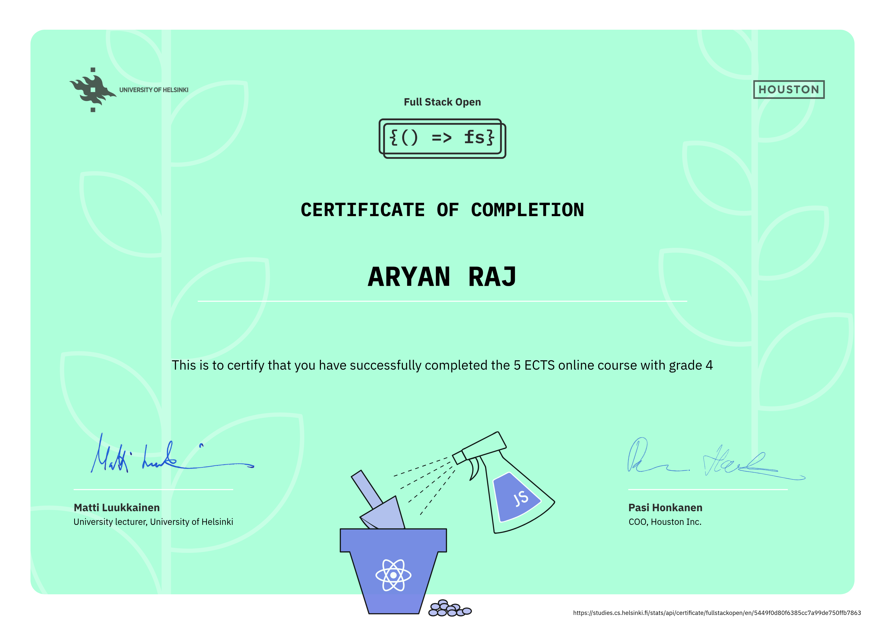

# FullStack Open

My solutions for the exercises of the University of Helsinki's Full Stack Open course.

## Course Progress

| Part  |  Status   | Exercises | Date Finished  |
| :---: | :-------: | :-------: | :------------: |
|   0   | Submitted |    6/6    |  17 June 2025  |
|   1   | Submitted |   14/14   |  24 July 2025  |
|   2   | Submitted |   20/20   |  31 July 2025  |
|   3   | Submitted |   22/22   | 12 August 2025 |
|   4   | Submitted |   22/23   | 27 August 2025 |
|   5   | Submitted |   22/23   | 2 October 2025 |

## Course Certificates

### Full Stack Open: Core Courses
