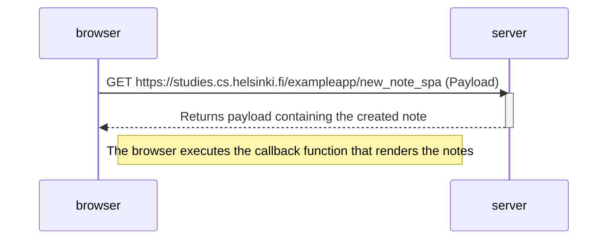

```mermaid

sequenceDiagram
    participant browser
    participant server

    browser->>server: GET https://studies.cs.helsinki.fi/exampleapp/new_note_spa (Payload)
    activate server
    server-->>browser: Returns payload containing the created note
    deactivate server

    Note right of browser: The browser executes the callback function that renders the notes

```